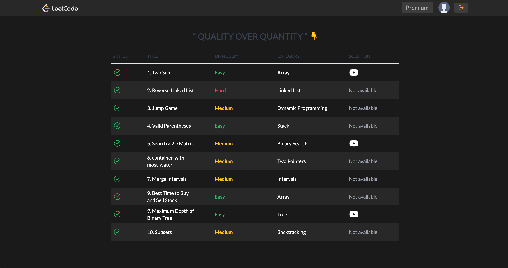
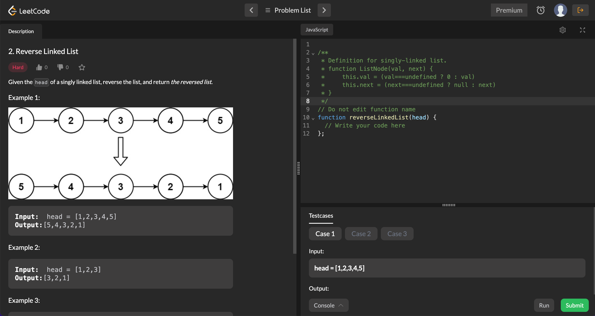

# LeetCode Clone

## General info

Welcome to the LeetCode Clone project! This is a platform designed for coding enthusiasts to solve coding problems and challenges, built using Next.js, Firebase Auth, and Firestore.

## Live preview

[link](https://affectionate-raman-1eac0c.netlify.app/)

## Screenshots

## Technologies

Project is created with:

- React
- NextJS
- Typescript
- TailwindCSS
- Firabse

## Setup

To set up the LeetCode Clone project locally, follow these steps:

- Clone the repository: git clone https://github.com/Nuri1977/leetcode-clone.git
- Install dependencies: cd leetcode-clone then npm install
- Set up Firebase project and obtain necessary credentials (Firebase Auth and Firestore).
- Configure Firebase credentials in the project (refer to documentation for details).
- Start the development server: npm run dev
- Access the project at http://localhost:3000.

## Author

👤 **Nuri Lacka**

- GitHub: [@Nuri1977](https://github.com/Nuri1977)
- Twitter: [@Lackanuri](https://twitter.com/LackaNuri)
- LinkedIn: [@nurilacka](https://www.linkedin.com/in/nuri-lacka-7141b01ba/)

## 🤝 Contributing

Contributions, issues, and feature requests are welcome!

Feel free to check the [issues page]().

## Show your support

Give a ⭐️ if you like this project!

## Acknowledgments

- A special thanks to .

## 📝 License

This project is [MIT](LICENSE) licensed.
